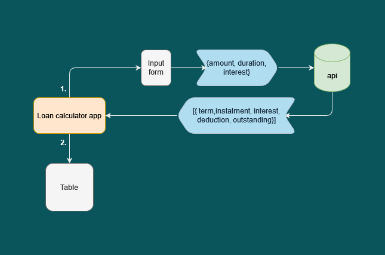

# Simple Loan Calculator
Simple loan calculator app created for a job interview.

## Tech stack
- **Frontend**
    - React.js
- **Backend**
    - Node.js with Express.js
- **Styling**
    - Material UI

## Design sketch



## How to initialize app and run locally

Requires [Node.js](https://nodejs.org/en/) with `npm`

Clone repository.
```
git clone https://github.com/munthy/simple_loan_calculator.git
```

Navigate to the `api` folder and run:
```
npm install
npm start
```

Open a new terminal instance, navigate to the `client` folder and run:
```
npm install
npm start
```

The app should now open in your browser.

## Expansion possibilities
The app can be expanded with more loan types by following these steps:

1. Add new loan calculation method to `loanCalculator.js`
2. Add new loan endpoint to `api.js`
3. Add loan type selector to `Calculator` component
4. Add `switch` statement for loan type to `submitData()` function


